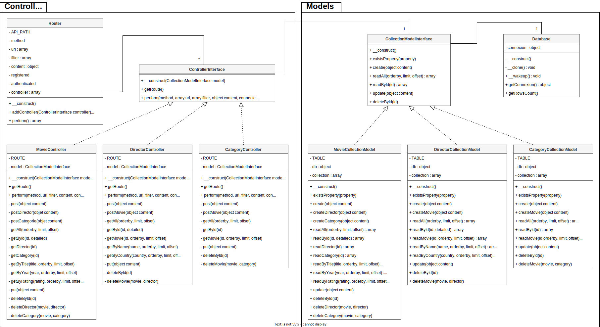

# VIDEO-API

## API REST EN PHP POUR BASE DE DONNEES SUR DES FILMS

Pour l'exercice, je veux reprendre un ancien dev sur l'ajax en JS : http://ianasheu.free.fr/video. La page d'origine permet des recherches sur des films. La future page sera faite avec React. Le premier travail procède en un découplage d'avec la base de données. Pour cela, plutôt que d'utiliser un framework, j'ai envie de développer l'api rest moi-même en php afin de couvrir les problématiques.


## SCHEMA RELATIONNEL DE LA BASE DE DONNEES


> _video-api-bdd-schema.png_


## REQUETE SQL DE CREATION DES TABLES DE LA BASE DE DONNEES

```
CREATE TABLE `movie` (
	`id` int NOT NULL auto_increment,
	`title` varchar(70) CHARACTER SET utf8mb4 COLLATE utf8mb4_0900_ai_ci NOT NULL,
	`year` int DEFAULT NULL,
	`rating` float DEFAULT NULL,
	`poster` varchar(150) CHARACTER SET utf8mb4 COLLATE utf8mb4_0900_ai_ci DEFAULT NULL,
	`allocine` varchar(12) CHARACTER SET utf8mb4 COLLATE utf8mb4_0900_ai_ci DEFAULT NULL,
	CONSTRAINT `movie_pk` PRIMARY KEY (`id`),
	CONSTRAINT `movie_u` UNIQUE (`id`),
	FULLTEXT INDEX (`title`)
) ENGINE=InnoDB DEFAULT CHARSET=utf8mb4 COLLATE=utf8mb4_general_ci;
```

```
CREATE TABLE `director` (
	`id` int NOT NULL auto_increment,
	`name` varchar(50) CHARACTER SET utf8mb4 COLLATE utf8mb4_0900_ai_ci NOT NULL,
	`country` varchar(5) CHARACTER SET utf8mb4 COLLATE utf8mb4_general_ci DEFAULT NULL,
	CONSTRAINT `director_pk` PRIMARY KEY (`id`),
	CONSTRAINT `director_u` UNIQUE (`id`),
	INDEX (`name`)
) ENGINE=InnoDB DEFAULT CHARSET=utf8mb4 COLLATE=utf8mb4_general_ci;
```
> (*) Dans la table des réalisateurs, le champ _country_, récent, ne contient pas encore de données renseignées dans la base.

```
CREATE TABLE `moviedirector` (
	`id` int NOT NULL auto_increment,
	`movie` int NOT NULL,
	`director` int NOT NULL,
	CONSTRAINT `moviedirector_pk` PRIMARY KEY (`id`),
	CONSTRAINT `moviedirector_u` UNIQUE (`id`),
	CONSTRAINT `movied_fk` FOREIGN KEY (`movie`) REFERENCES `movie` (`id`),
	CONSTRAINT `director_fk` FOREIGN KEY (`director`) REFERENCES `director` (`id`)
) ENGINE=InnoDB DEFAULT CHARSET=utf8mb4 COLLATE=utf8mb4_general_ci;
```

```
CREATE TABLE `category` (
	`id` int NOT NULL auto_increment,
	`tag` varchar(70) CHARACTER SET utf8mb4 COLLATE utf8mb4_0900_ai_ci NOT NULL,
	CONSTRAINT `category_pk` PRIMARY KEY (`id`),
	CONSTRAINT `category_u` UNIQUE (`id`),
	INDEX (`tag`)
) ENGINE=InnoDB DEFAULT CHARSET=utf8mb4 COLLATE=utf8mb4_general_ci;
```

```
CREATE TABLE `moviecategory` (
	`id` int NOT NULL auto_increment,
	`movie` int NOT NULL,
	`category` int NOT NULL,
	CONSTRAINT `moviecategory_pk` PRIMARY KEY (`id`),
	CONSTRAINT `moviecategory_u` UNIQUE (`id`),
	CONSTRAINT `moviec_fk` FOREIGN KEY (`movie`) REFERENCES `movie` (`id`),
	CONSTRAINT `category_fk` FOREIGN KEY (`category`) REFERENCES `category` (`id`)
) ENGINE=InnoDB DEFAULT CHARSET=utf8mb4 COLLATE=utf8mb4_general_ci;
```
Afin de limiter les messages d'erreur, la base de données est configurée pour tronquer les données si elles dépassent la taille du champ cible.


## DIAGRAMME DE CLASSES UML DU CODE PHP DE L'API


> _video-api-uml.drawio.svg_

Commentaires : Le type des propriétés de classe n'est pas renseigné s'il est scalaire (booléen, entier, nombre décimal, chaîne de caractères). En revanche, il est renseigné si c'est un tableau ou un objet. Il en sera de même pour les types des arguments des méthodes de classe ainsi que les types de valeur de retour. De plus, le type de retour d'une méthode qui ne retourne rien sera indique avec void (sauf pour les constructeurs). C'est proche du mode strict.

Limitations : Il n'y a pas de version ni de cache. Sont absents de l'archive les fichiers Controllers/users_config.php et Models/db_config_ovh.php. De plus, sont aussi absents du diagramme les fichiers .htaccess, index.php, Autoloader.php, Models/MovieItemModel.php, Models/DirectorItemModel.php, Models/CategoryItemModel.php et Views/json_view.php.

> sources : [video-api-main.zip](https://github.com/ianasheu/video-api/archive/refs/heads/main.zip)


## DESCRIPTION DES APPELS

#### DOMAINE

> https://www.ianasheu.com

#### RACINE DE L API
> /video/api

#### RESSOUCES
> - movie
> - director
> - category

Une clé API est obligatoire et doit être renseignée dans le header X-Api-Key. De plus, une identification basique est demandée pour les méthodes autres que GET. Un content au format json est nécessaire pour les méthodes POST et PUT. La valeur renseignée pour l'id, que ce soit dans l'url ou dans le content, doit être numérique.

#### FILTRES
> - orderby
> - limit
> - offset
> - detailed

Utilisable pour les méthodes GET. Le critère passé à orderby doit être une propriété de la ressource avec laquelle il est utilisé. Les valeurs passées à limit et offset doivent être numériques. Les valeurs passées à detailed doivent être true ou false.

## MOVIE

Les valeurs pour year et rating doivent être numériques.

```
	method POST
	request
		/video/api/movie
			Authorization : Basic login:password
			Content-Type : application/json
			Content : {
				"title" : "createdMovie",
				["year" : "releaseYear",]
				["rating" : "fiveRating",]
				["poster" : "fileNameJpg",]
				["allocine" : "idAllocine"]
			}
	response
		ok: 201 > newId
		ko: 400 > errorMessage
```

```
	method POST
	request
		/video/api/movie/director
			Authorization : Basic login:password
			Content-Type : application/json
			Content : {
				"movie" : "associateMovie",
				"director" : "associateDirector"
			}
	response
		ok: 201 > newId
		ko: 400 > errorMessage
```

```
	method POST
	request
		/video/api/movie/category
			Authorization : Basic login:password
			Content-Type : application/json
			Content : {
				"movie" : "associateMovie",
				"director" : "associateDirector"
			}
	response
		ok: 201 > newId
		ko: 400 > errorMessage
```

```
	method GET
	request
		/video/api/movie
		filtres possibles : orderby, limit, offset, detailed
	response
		ok: 200 > []
		ko: 404
		ko: 400 > errorMessage
```
> exemple : [/video/api/movie?orderby=year&limit=37&offset=8](https://www.ianasheu.com/video/api/movie?orderby=year&limit=37&offset=8)

```
	method GET
	request
		/video/api/movie/id/{id}
		filtres possibles : detailed
	response
		ok: 200 > []
		ko: 404
		ko: 400 > errorMessage
```
> exemple : [/video/api/movie/id/184?detailed=true](https://www.ianasheu.com/video/api/movie/id/184?detailed=true)

```
	method GET
	request
		/video/api/movie/id/{id}/director
	response
		ok: 200 > []
		ko: 404
		ko: 400 > errorMessage
```
> exemple : [/video/api/movie/id/184/director](https://www.ianasheu.com/video/api/movie/id/184/director)

```
	method GET
	request
		/video/api/movie/id/{id}/category
	response
		ok: 200 > []
		ko: 404
		ko: 400 > errorMessage
```
> exemple : [/video/api/movie/id/184/category](https://www.ianasheu.com/video/api/movie/id/184/category)

```
	method GET
	request
		/video/api/movie/title/{*title*}
		filtres possibles : orderby, limit, offset, detailed
	response
		ok: 200 > []
		ko: 404
		ko: 400 > errorMessage
```
> exemple : [/video/api/movie/title/\*vous\*chez\*](https://www.ianasheu.com/video/api/movie/title/*vous*chez*)

```
	method GET
	request
		/video/api/movie/year/{year}
		filtres possibles : orderby, limit, offset, detailed
	response
		ok: 200 > []
		ko: 404
		ko: 400 > errorMessage
```
> exemple : [/video/api/movie/year/2020](https://www.ianasheu.com/video/api/movie/year/2020)

```
	method GET
	request
		/video/api/movie/rating/{rating}
		filtres possibles : orderby, limit, offset, detailed
	response
		ok: 200 > []
		ko: 404
		ko: 400 > errorMessage
```
> exemple : [/video/api/movie/rating/3.5?orderby=year&limit=10&offset=90](https://www.ianasheu.com/video/api/movie/rating/3.5?orderby=year&limit=10&offset=90)

```
	method PUT
	request
		/video/api/movie
			Authorization : Basic login:password
			Content-Type : application/json
			Content : {
				"id" : "id",
				"title" : "updatedTitle",
				["year" : "releaseYear",]
				["rating" : "fiveRating",]
				["poster" : "fileNameJpg",]
				["allocine" : "idAllocine"]
			}
	response
		ok: 204
		ko: 404
```

```
	method DELETE
	request
		/video/api/movie/id/{id}
			Authorization : Basic login:password
	response
		ok: 204
		ko: 404
```

```
	method DELETE
	request
		/video/api/movie/id/{id}/director/id/{id}
			Authorization : Basic login:password
	response
		ok: 204
		ko: 404
```

```
	method DELETE
	request
		/video/api/movie/id/{id}/category/id/{id}
			Authorization : Basic login:password
	response
		ok: 204
		ko: 404
```

## DIRECTOR

```
	method POST
	request
		/video/api/director
			Authorization : Basic login:password
			Content-Type : application/json
			Content : {
				"name" : "createdDirector",
				["country" = "countryCode"]
			}
	response
		ok: 201 > newId
		ko: 400 > errorMessage
```

```
	method POST
	request
		/video/api/director/movie
			Authorization : Basic login:password
			Content-Type : application/json
			Content : {
				"movie" : "associateMovie",
				"director" : "associateDirector"
			}
	response
		ok: 201 > newId
		ko: 400 > errorMessage
```

```
	method GET
	request
		/video/api/director
		filtres possibles : orderby, limit, offset
	response
		ok: 200 > []
		ko: 404
		ko: 400 > errorMessage
```
> exemple : [/video/api/director?orderby=name&limit=12&offset=0](https://www.ianasheu.com/video/api/director?orderby=name&limit=12&offset=0)

```
	method GET
	request
		/video/api/director/id/{id}
		filtres possibles : detailed
	response
		ok: 200 > []
		ko: 404
		ko: 400 > errorMessage
```
> exemple : [/video/api/director/id/47?detailed=true](https://www.ianasheu.com/video/api/director/id/47?detailed=true)

```
	method GET
	request
		/video/api/director/id/{id}/movie
		filtres possibles : orderby, limit, offset
	response
		ok: 200 > []
		ko: 404
		ko: 400 > errorMessage
```
> exemple : [/video/api/director/id/47/movie](https://www.ianasheu.com/video/api/director/id/47/movie)

```
	method GET
	request
		/video/api/director/name/{*name*}
		filtres possibles : orderby, limit, offset
	response
		ok: 200 > []
		ko: 404
		ko: 400 > errorMessage
```
> exemple : [/video/api/director/name/\*sp\*](https://www.ianasheu.com/video/api/director/name/*sp*)

```
	method GET
	request
		/video/api/director/country/{country}
		filtres possibles : orderby, limit, offset
	response
		ok: 200 > []
		ko: 404
		ko: 400 > errorMessage
```
> exemple : [/video/api/director/country/US](https://www.ianasheu.com/video/api/director/country/US)

```
	method PUT
	request
		/video/api/director
			Authorization : Basic login:password
			Content-Type : application/json
			Content : {
				"id" : "id",
				"name" : "updatedName",
				["country" : "countryCode"]
			}
	response
		ok: 204
		ko: 404
```

```
	method DELETE
	request
		/video/api/director/id/{id}
			Authorization : Basic login:password
	response
		ok: 204
		ko: 404
```

```
	method DELETE
	request
		/video/api/director/id/{id}/movie/id/{id}
			Authorization : Basic login:password
	response
		ok: 204
		ko: 404
```

## CATEGORY

```
	method POST
	request
		/video/api/category
			Authorization : Basic login:password
			Content-Type : application/json
			Content : {
				"tag" : "createdCategory"
			}
	response
		ok: 201 > newId
		ko: 400 > errorMessage
```

```
	method POST
	request
		/video/api/category/movie
			Authorization : Basic login:password
			Content-Type : application/json
			Content : {
				"movie" : "associatedMovie",
				"category" : "associatedCategory"
			}
	response
		ok: 201 > newId
		ko: 400 > errorMessage
```

```
	method GET
	request
		/video/api/category
		filtres possibles : orderby, limit, offset
	response
		ok: 200 > []
		ko: 404
		ko: 400 > errorMessage
```
> exemple : [/video/api/category?orderby=tag&limit=6&offset=0](https://www.ianasheu.com/video/api/category?orderby=tag&limit=6&offset=0)

```
	method GET
	request
		/video/api/category/id/{id}
	response
		ok: 200 > []
		ko: 404
		ko: 400 > errorMessage
```
> exemple : [/video/api/category/id/5](https://www.ianasheu.com/video/api/category/id/5)

```
	method GET
	request
		/video/api/category/id/{id}/movie
		filtres possibles : orderby, limit, offset
	response
		ok: 200 > []
		ko: 404
		ko: 400 > errorMessage
```
> exemple : [/video/api/category/id/5/movie?orderby=rating&limit=20&offset=240](https://www.ianasheu.com/video/api/category/id/5/movie?orderby=rating&limit=20&offset=240)

```
	method PUT
	request
		/video/api/category
			Authorization : Basic login:password
			Content-Type : application/json
			Content : {
				"id" : "id",
				"tag" : "updatedTag"
			}
	responses
		ok: 204
		ko: 404
```

```
	method DELETE
	request
		/video/api/category/id/{id}
			Authorization : Basic login:password
	responses
		ok: 204
		ko: 404
```

```
	method DELETE
	request
		/video/api/category/id/{id}/movie/id/{id}
			Authorization : Basic login:password
	responses
		ok: 204
		ko: 404
```


## CODES HTTP REPONSES POSSIBLES
- 200 Ok
- 201 Created
- 204 No Content
- 400 Bad Request
- 401 Unauthorized
- 403 Forbidden
- 404 Not Found
- 405 Method Not Allowed
- 503 Service Unavailable


## HEADERS REPONSES POSSIBLES
- X-Authenticate-Error: API-Key
- WWW-Authenticate: Basic
- X-Error-Message
- X-Total-Count
